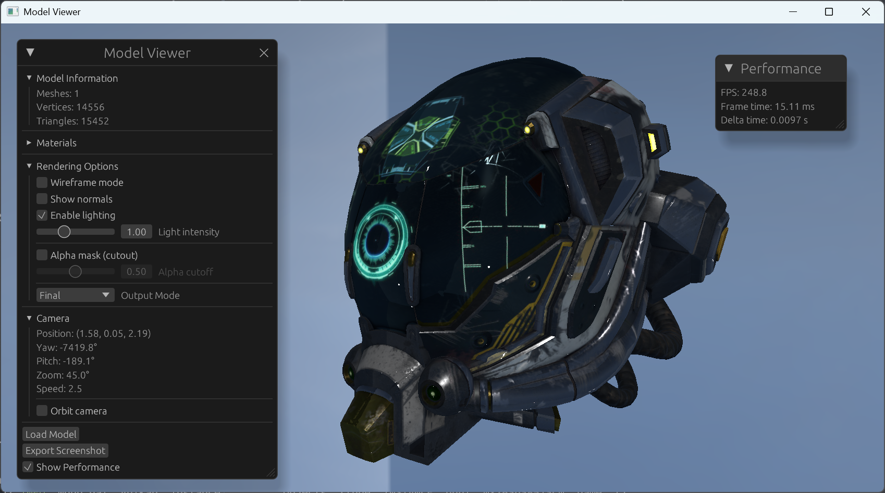

# Model Viewer (asset-importer + wgpu)

This is a small model viewer built on top of the Assimp Rust binding [asset-importer](https://github.com/Latias94/asset-importer). It serves as a practical sample and a testbed to validate asset-importer across common formats.



## Highlights

- WGPU + Winit + EGUI (wgpu v25, winit v0.30, egui v0.32)
- Assimp-driven loading via asset-importer v0.4 (external and embedded textures)
- Physically-Based Rendering (metallic-roughness)
  - Base color, normal, metallic-roughness, occlusion, emissive
  - UV0/UV1, per-texture UV transforms, vertex colors
- Image-Based Lighting (IBL)
  - Generates irradiance, prefiltered environment (mips), and BRDF LUT from HDR
  - Cubemap skybox rendered from the environment
- Lights: multiple punctual lights imported from the scene
- Multi-pass forward renderer
  - Skybox → Opaque → Two-Sided → OpaqueTransparent → Transparent
  - Basic transparent sorting; alpha-mask and blend paths
- Debug views and GUI panel (output channels, material info, basic controls)

## Build & Run

```bash
cargo run --bin download-assets
cargo run --bin model-viewer -- "assets/glTF-Sample-Assets-main/Models/DamagedHelmet/glTF/DamagedHelmet.gltf"
```

Point it at any supported model file; the glTF-Sample-Assets Helmet is a good sanity check.

## Notes

- This project is focused on feature coverage and correctness as a companion to asset-importer, not raw performance.
- Tested primarily on desktop (wgpu Vulkan/DirectX backends).
